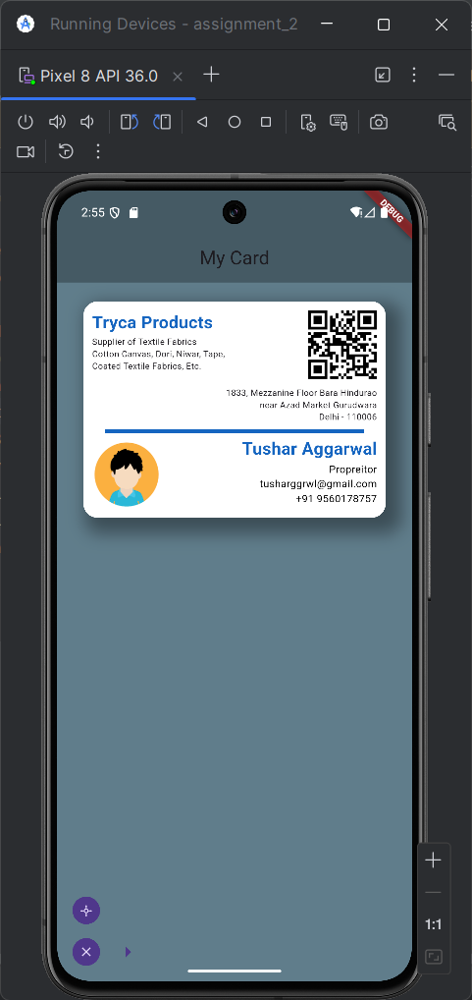
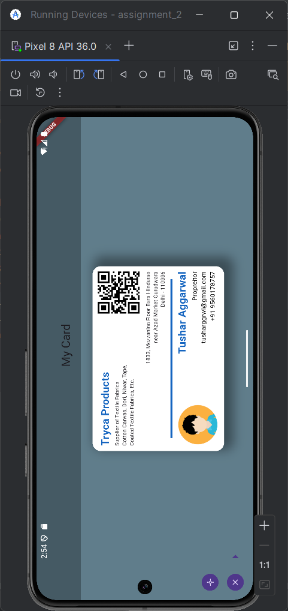

# Assignment 2

A Flutter project to display q business card.

### Design Requirements
- Outer Container
  - The width is kept at 350.
  - Padding and Margins are used
  - Border Radius is used
  - There is a background colour
  - Box Shadow is used
- Content inside the container
  - Circular Container with Profile Picture on left side
  - Multiple Text widgets have been used for
    - Name
    - Designation
    - Description
    - Contact info

## Screenshots

### Portrait

### Landscape
